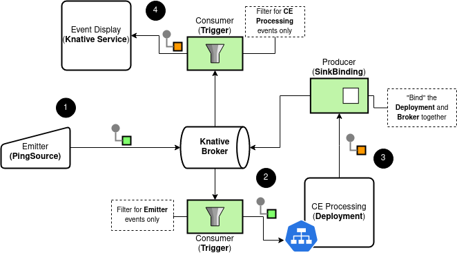

# CloudEvents Processing

This is a very simple showcase of how to use the [CloudEvent Java SDK](https://github.com/cloudevents/sdk-java) to process
events in a Kubernetes cluster on top of Knative.

The following image illustrates the architecture of the showcase.
Take a look at the [`kubernetes`](kubernetes) directory for more details about the
objects created in the cluster.



## Try it out locally

This image is available on Quay.io:

```shell script
$ podman run --rm -it -p 8080:8080 quay.io/ricardozanini/ce-processing:1.0
```

Then just `curl` the 8080 port:

```shell script
$ curl -X POST \
    -H "content-type: application/json"  \
    -H "ce-specversion: 1.0"  \
    -H "ce-source: curl-command"  \
    -H "ce-type: curl.demo"  \
    -H "ce-id: 123-abc"  \
    -d '{"name":"Zanini"}' \
http://localhost:8080
```

You should see the application logs like:

```shell script
19:20:51.078 [vert.x-eventloop-thread-1] INFO  o.m.c.ce.CloudEventConsumerVerticle - Initializing Vertx Server
19:20:51.178 [vert.x-eventloop-thread-2] INFO  o.m.c.ce.CloudEventProducerVerticle - CE Publisher started, will publish events to 'http://localhost:8080/' endpoint
19:20:51.180 [vert.x-eventloop-thread-0] INFO  org.m88i.cloud.ce.MainVerticle - Successfully deployed MainVerticle
19:20:51.183 [vert.x-eventloop-thread-1] INFO  o.m.c.ce.CloudEventConsumerVerticle - Server started on port 8080
Jul 10, 2020 7:20:51 PM io.vertx.core.impl.launcher.commands.VertxIsolatedDeployer
INFO: Succeeded in deploying verticle
19:21:05.802 [vert.x-eventloop-thread-1] INFO  o.m.c.ce.CloudEventConsumerVerticle - Received event: 
☁ ️cloudevents.Event
Context Attributes,
	specversion: 1.0
	type: curl.demo
	source: curl-command
	id: 123-abc
	time: null
Extensions,
Data,
	{"name":"Zanini"}
19:21:05.822 [vert.x-eventloop-thread-2] INFO  o.m.c.ce.CloudEventProducerVerticle - Received internal message. Creating new CE request to http://localhost:8080/
19:21:05.869 [vert.x-eventloop-thread-1] INFO  o.m.c.ce.CloudEventConsumerVerticle - Received event: 
☁ ️cloudevents.Event
Context Attributes,
	specversion: 1.0
	type: success.ce.demo
	source: 69af641bcc77
	id: 67c4944f-7379-40d5-b2b9-ea2bd436353b
	time: null
Extensions,
Data,
	CE Processed ID: 123-abc
19:21:05.870 [vert.x-eventloop-thread-1] INFO  o.m.c.ce.CloudEventConsumerVerticle - Won't emit a follow up CloudEvent since CloudEvent{id='67c4944f-7379-40d5-b2b9-ea2bd436353b', source=69af641bcc77, type='success.ce.demo', datacontenttype='null', dataschema=null, subject='null', time=null, data=[67, 69, 32, 80, 114, 111, 99, 101, 115, 115, 101, 100, 32, 73, 68, 58, 32, 49, 50, 51, 45, 97, 98, 99], extensions={}} comes from a local source
```

## Running with Knative Eventing

1. Install [`minikube`](https://kubernetes.io/docs/tasks/tools/install-minikube/) and `kubectl` or have a Kubernetes cluster available
2. Setup [Istio + Knative](https://knative.dev/docs/install/)

```shell script
# create the namespace
kubectl create namespace ce
# enable Knative Eventing injection
kubectl label namespace ce knative-eventing-injection=enabled
# deploy the application
kubectl apply -f kubernetes/ce-service-deploy.yaml -n ce
# deploy consumer and producers for the application
kubectl apply -f kubernetes/consumer-trigger.yaml -n ce
kubectl apply -f kubernetes/producer-sinkbinding.yaml -n ce
# deploy the event display
kubectl apply -f kubernetes/event-display.yaml -n ce
# deploy the event source
kubectl apply -f kubernetes/emitter.yaml -n ce
```

To see the showcase in action, try looking the logs of the deployed application:

```shell script
kubectl logs -f ce-processing-<hash> -n ce
```

## References

- [Setting up Knative Eventing Resources](https://knative.dev/docs/eventing/getting-started/#setting-up-knative-eventing-resources)
- [Processing CloudEvents with Eclipse Vert.x](https://developers.redhat.com/blog/2018/12/11/processing-cloudevents-vertx/)
- [CloudEvents Java SDK](https://github.com/cloudevents/sdk-java/tree/master/http/vertx)